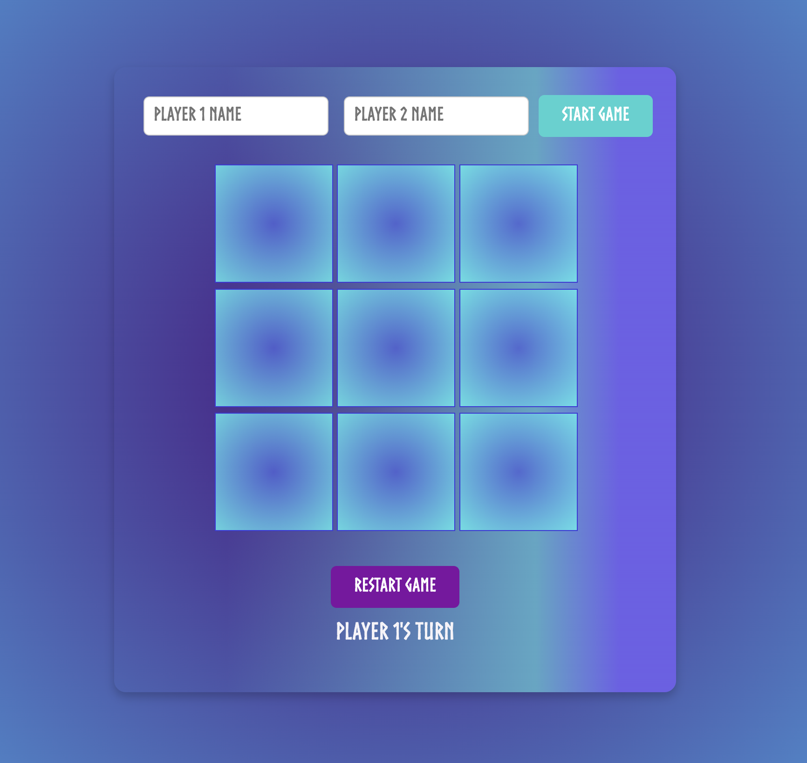
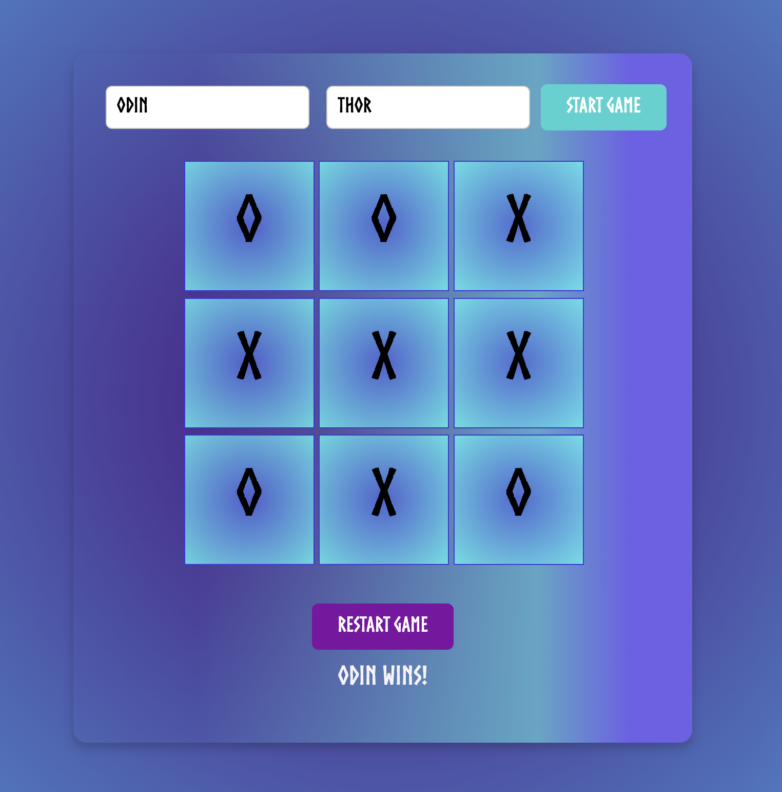

🎮 ***Tic-Tac-Toe Game***

Welcome to the Tic-Tac-Toe Game! This project is a web-based implementation of the classic Tic-Tac-Toe game, built using HTML, CSS, and JavaScript. You can play against a friend or soon, against a robust AI opponent with different difficulty levels. The game is designed with a sleek and modern user interface that I’m constantly working to improve.

✨ #Features

	•	2-Player Mode: Enter player names and take turns playing on a 3x3 grid.
	•	Start/Restart Game: Simple buttons to start a new game or restart after a match is completed.
	•	Turn Indicator: Display whose turn it is so players stay informed.
	•	Responsive Design: Game layout adapts to different screen sizes.

🚀 Upcoming Improvements

We are actively working on enhancing the functionality and aesthetics of the Tic-Tac-Toe game. Here are the improvements we plan to add:

1. AI Opponent

	•	Play against a Robot (AI): We’re building an AI opponent you can play against when no second player is available.
	•	Choose Difficulty Level:
	•	Easy: The AI will make random moves.
	•	Medium: The AI will use a strategy to block your winning moves and make smarter choices.
	•	Hard: The AI will use the unbeatable “minimax” algorithm, making it very challenging to beat.

2. Enhanced CSS and Layout Improvements

	•	New Color Themes: We’ll be adding multiple theme options so you can customize the game board’s colors to match your preferences.
	•	Better Spacing and Layout: We’ll refine the layout so the grid, buttons, and text are spaced evenly and look great on all devices, from desktop to mobile.
	•	Hover and Animation Effects: Buttons and grid cells will have hover effects and subtle animations to improve the interactive experience.
	•	Winning Animation: When a player wins, there will be a celebratory animation highlighting the winning line (horizontal, vertical, or diagonal).

3. Improved User Experience

	•	Error Handling: We plan to add better feedback for invalid actions, like clicking on a cell that is already taken.
	•	Score Tracking: We’ll add a scoring system that tracks wins, losses, and draws between the two players or you versus the AI.
	•	Mobile Optimization: Ensure the game looks good and functions smoothly on smaller screens and touch devices.

📷 Screenshots

Start Game	Game in Progress	Winning Screen
		
| **Start Game**  | **Game in Progress**  | **Winning Screen**  |
|-----------------|-----------------------|---------------------|
|  |  |  |
🤝 Contributing
